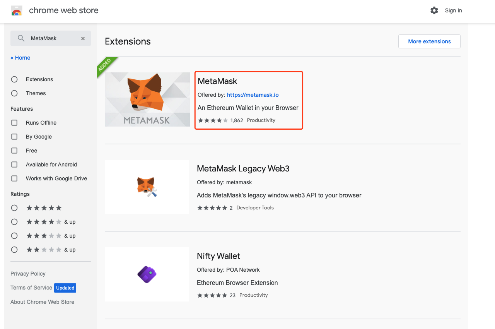
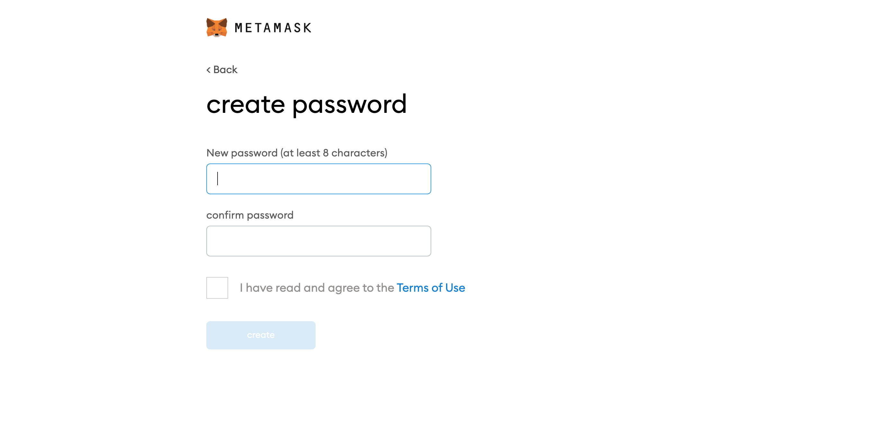
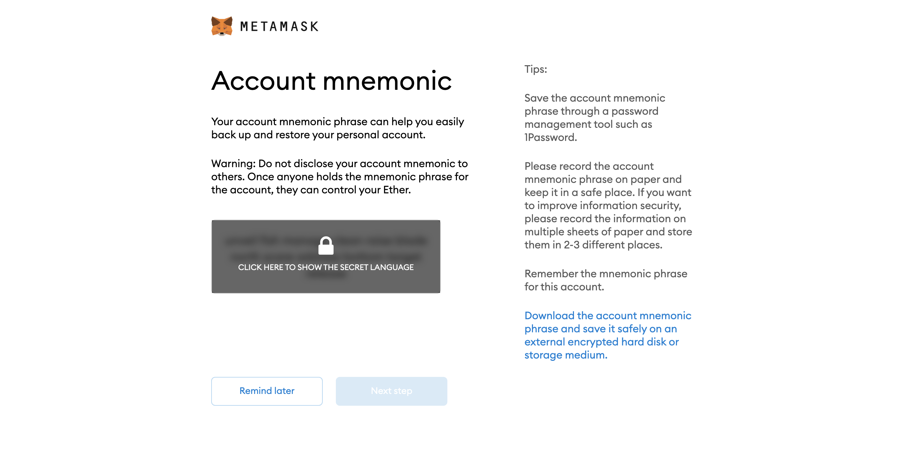
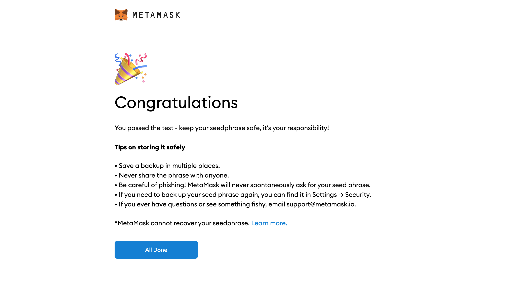
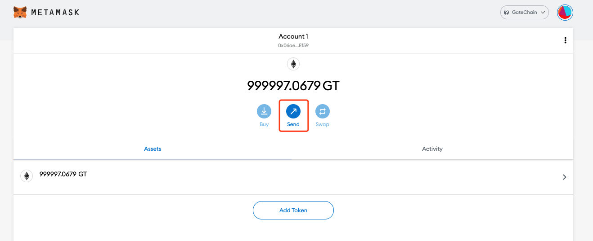
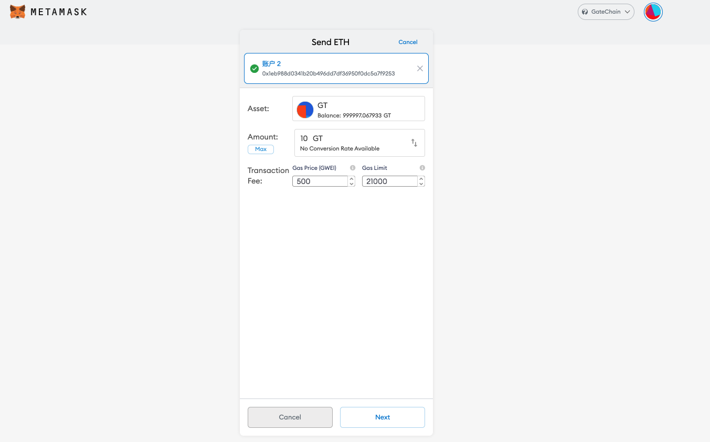
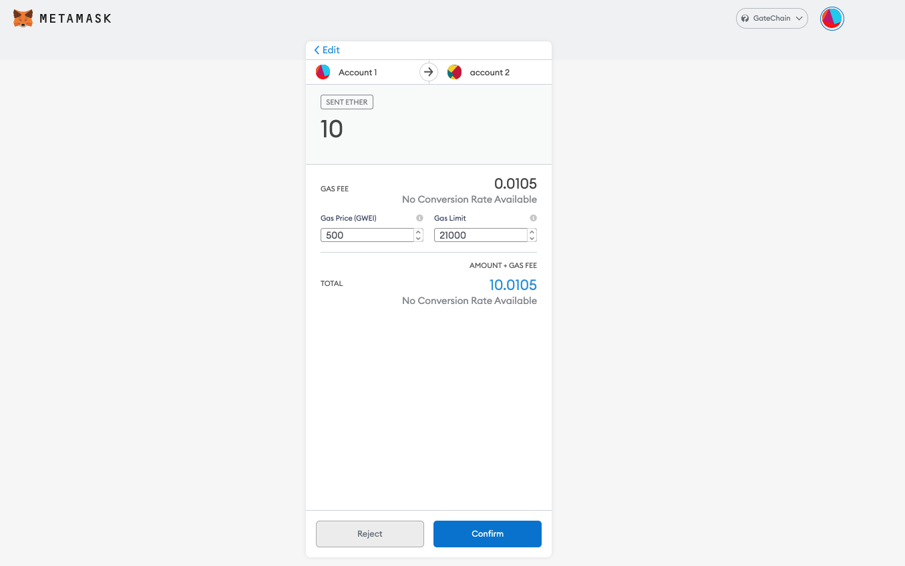
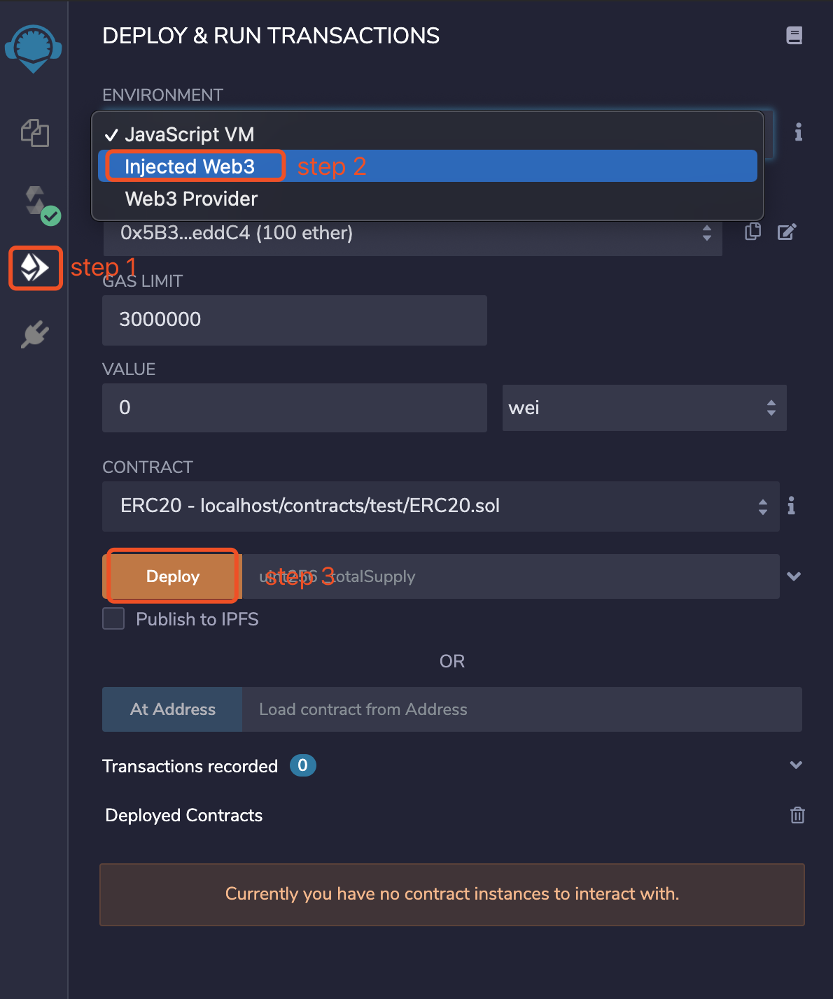
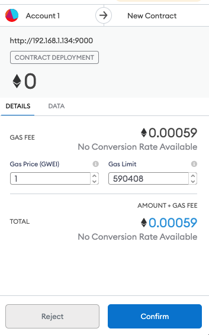
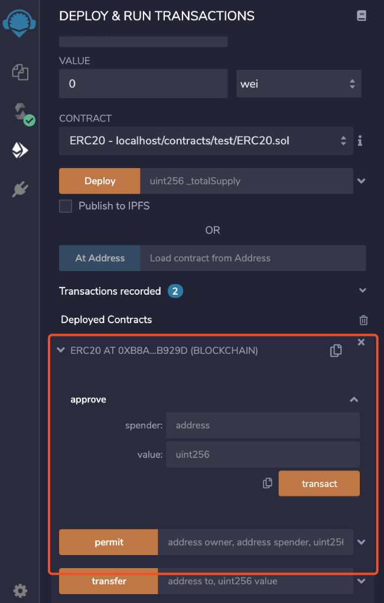

## Block Explorer
Mainnet：http://explorer.gatechain.io/mainnet

Testnet：http://explorer.gatechain.io/testnet

Meteora：http://explorer.gatechain.io/meteora

## Wallets Download
Download：https://www.gatechain.io/wallets

## How to Connect MetaMask

`GateChain-Evm` is the native module based on `Gatemint` consensus, which supports `Ethereum` smart contracts and provides rpc services to connect to `MetaMask`. Users can deploy and call contracts on `GateChain` by simply switching to `GateChain` network. 

### MetaMask Introduction

`MetaMask` is created to build a more safe and accessible `Ethereum` network. It connects users to blockchain and manage accounts, supported on Chrome, Brave and Safari.

### Install

Example: Install in Chrome browser

1. In Chrome browser, seach：https://chrome.google.com/webstore/search/MetaMask
	* note：make sure it is provided by metamask.io


2. CLick “Add to Chrome”. It is installed now and you can create your account. 


### Create Account

1. You can choose to import a wallet or create a wallet. Click “Create a wallet”

2. Enter password and backup account mnemonic


3. When the mnemonic is verified, the account is successfully created. You can connect to gatechain now!



### Connect MetaMask to GateChain

1. Click MetaMask-Setup-Network-Add Network, and configure GateChain network service


> Network name: GateChain （customized）
> 
> RPC URL: http://mainnet.gatenode.cc:6060
> 
> Chain ID: 66
> 
> Symbol: GT
> 
> Block explorer: https://explorer.gatechain.io/mainnet/

### Transfer balance from your “gt” account to your MetaMask account.

1. Transfer from your wallet: copy an MetaMask account address, and paste to the recipient wallet field in your wallet. Transfer- To [[Step by step instruction]](../gatechain-wallet.md#evm)

2. Transfer using CLI or RPC：similar to a transfer from a wallet, just provide the recipient address to send transaction to. 
> [[CLI User Guide]](../cli/tx.md#send-transaction-api)
> 
> [[RPC User Guide]](../API/tx.md#send-transaction-command-line )

### Transfer GT to another MetaMask account

1. Chose the account to send asset to, then got to Homepage and click"Send"button

2. Enter the amount and To address, click "NEXT".

3. Double check transaction and click "Confirm". The transaction will be waiting for being included in blockchain.

4. When the transaction is successful, view transaction details from a gatechain block explorer.
	
* BLock explorer：http://explorer.gatechain.io/mainnet/transactions

>Read below for how to deploy contract and interact with contract.

## How to Connect Remix

###About Remix 
Remix is an open sourced Solidity IDE that's used to write, compile and debug contracts. 
Solidity is the programming language designed for developing smart contracts on Ethereum. 

### Create Contract

1. Open remix website（http://remix.ethereum.org , click “New File” to create a XXX.sol file

2. Click the file you created, and start to write your own smart contract code. 
3. Once the development is completed, start compiling smart contract. 


### Deploy and Interact with Smart Contract

1. Once compilation is completed, start deploying the smart contract.
	
2. Click“Deploy” to start to deploy the smart contract. Jump to MetaMask to connect to your account

	>（Make sure MetaMask network is on GateChain）
	
3. Open the deployed contract and you can choose a functionality to interact with MetaMask!
	
4. Query details about contract interaction on the gatechain block explorer.

	* Block explorer：http://explorer.gatechain.io/mainnet/transactions

## Connect to Truffle

### Build a dev environment
Before you start, make sure the environment meet the following requirements：

* Node.js v8.9.4 or higher
* Windows，Linux，or Mac OS X

### Create a project
1. Create a project and enter the following command in the terminal：
```
mkdir testproject
```
2. Initialize the project, and enter the following command in the terminal：
```
cd testproject
truffle init
```
Once completed, you will get a project structure like below: 
```
contracts/：Truffle default contract files directory
migrations /：deployment scripts files directory
test /：contract or application test files directory
truffle-config.js：Truffle config files.
```
3. contracts write your own contract under this directory.

### Compile and deploy a project

1. To compile a Truffle project, please go to the root directory of the project and enter the following command in the terminal:
```
truffle compile
```
2. To configure GateChain network, please go to “truffle-config.js” file.
```
const HDWalletProvider = require('truffle-hdwallet-provider');
const fs = require('fs');
const mnemonic = fs.readFileSync(".secret").toString().trim();
	
	module.exports = {
	  networks: {
	    GateChain: {
	      provider: () => new HDWalletProvider(mnemonic, `http://mainnet.gatenode.cc:6060`),
	      network_id: 66,
	      confirmations: 10,
	      timeoutBlocks: 200,
	      skipDryRun: true
	    },
	  },
	
	  mocha: {
	    timeout: 100000 // prevents tests from failing when pc is under heavy load
	  },
	
	  compilers: {
	    solc: {
	    }
	  }
	}
```
> Please note：the mnemonic phrase for MetaMask account is required. Please fetch the mnemonic phrase from the deployed account, method：MetaMask-Setup-Security and Privacy，create a new .secret file from the root directory and enter the mnemonic phrase to start
3. Deploy the project, and enter the following command in the terminal：
```
truffle migrate --network GateChain
```
4. Contract will be deployed in GateChain network, as below：

```
	Compiling your contracts...
	===========================
	> Everything is up to date, there is nothing to compile.
		
		
	Starting migrations...
	======================
	> Network name:    'GateChain'
	> Network id:      66
	> Block gas limit: 4294967295 (0xffffffff)
		
		
	1_initial_migration.js
	======================
		Replacing 'Migrations'
		----------------------
		> transaction hash:    0x2eaa10bd0a8cdd55022fd6a16372659a5fd52151b216a82d07f397c1c91642fe
		> Blocks: 0            Seconds: 4
		> contract address:    0x871e6B5eEaC4d69E33880cac1997F1374302eddC
		> block number:        98767
		> block timestamp:     1614756393
		> account:             0x06ae7981a16379fD627a879Ec017AaDFaa4BEf59
		> balance:             260.04901
		> gas used:            128511 (0x1f5ff)
		> gas price:           10000 gwei
		> value sent:          0 ETH
		> total cost:          1.28511 ETH
		   
	Summary
	=======
	> Total deployments:   1
	> Final cost:          1.28511 ETH
	
```

> Please note, the above are examples only for helping you have a better understanding about the structure.


