# 1. GateChain Wallet Introduction

> Subsequent development is ongoing, and multiple network reset operations may occur during the test phase.
> The test token may be emptied in the reset, please request new test token from the testnet.

GateChain ecosystem provides a variety of wallet applications to cater to differentiated demands from individual, professional and enterprise users.

* At testnet phase, GateChain provides desktop wallets for Windows and Mac OS. Professional users can also access and test using RPC.

* At mainnet phase, GateChain will provide command-line wallet, mobile wallet for Android and iOS, Web wallet, multi-signature wallet, and hardware wallet, among others to cater to individual, professional and enterprise users.

## 2. Related Definitions
### 2.1 GateChain Address Types ###

GateChain have two  main account types, Standard Account and Vault Account, with different  identifier at the start in their addresses:

* Standard Account：start with “gt’’. “gt1” indicates a single- signature Standard Account, and “gt2” indicates a multi- signature  Standard Account.
* Vault Account：start with “vault’.“vault 1” indicates a single- signature Vault Account, and “ vault2” indicates a multi- signature   Vault Account.

With the address identifier mechanism invented by GateChain, the recipient account can easily identify the sending account's  type and set confirmation requirement  accordingly.If it is from a Vault Account, confirmation is safe  only after revocable delay period.

### 2.2 GateChain Transaction Types ###

GateChain has many transaction types.  To identify different transaction types efficiently, GateChain creatively provides transaction type identifier.

Below are identifiers  different  transaction types start with:

* Irrevocable Pay：“IRREVOCABLEPAY-”
* Revocable Pay：“REVOCABLEPAY-”
* Account Set： “ACCOUNTSET-”
* Vault Create：“VAULTCREATE-”
* Revoke: “REVOKE-”
* Vault Clear：“VAULTCLEAR-”
* Untitled： “BASIC-”

### 2.3 Other Definitions ###
* Retrieval Account：the preset  account  bound  to  a Vault Account. When a transaction in vault account is revoked, the transaction asset will be moved to this account. 

* Revocable Delay Period ：The valid duration during which a “revoke ” operation is  allowed after the revocable transaction is initiated. That is,after the revocable transaction is initiated, “revok’ operation is allowed before the preset number of blocks are generated.

*Clearing Height：it is a future time. At the time when this future block height is hit, the asset in the account will allow clearing. 

>Any “Time” settings at GateChain is calculated in block height. The current block time is 1s. Please use it as a reference when setup the above time.

## 3. Download and installation

- You can go to CateChain website [www.gatechain.io](https://www.gatechain.io) and click “Wallet Downloads” at the upper corner to  download correct wallet version for your operation system.   
	
- You can also access to [https://www.gatechain.io/wallets](https://www.gatechain.io/wallets)  to download wallet for PC.
  	
	>Wallets are  available for Windows  and  Mac OS at this time

## 4. Get Started

### 4.1 Password and safety
- GateChain provides local wallets and  need not to register an account before logging in. But setting up a login password is required when running the wallet for the first time.  The password will also be used as “unlock password” for many other operations at the wallet. It is of vital Importance!  If it is lost, your asset will be at risk. Please setup a complicated password and save it safely.  

- Revocable transaction is invented by GateChain. To avoid abuse of this safety feature, GateChain uses prefix identifiers to give distinct mark. When receiving a transaction, you can check with  two rules to determine if it is  irrevocable and safe to use. 
> 1. Standard Account starts with" gt". Transactions from address starting with “gt” is irrevocable.
> 2. Transaction ID from Standard Account starts with" IRREVOCABLEPAY-" .Transaction with this prefix is irrevocable.
> 
### 4.2 Create Standard Account
- 1 ）At main interface, click “Create Account ” , then  choose   “Single Signature ”-->> “Standard Account ”.

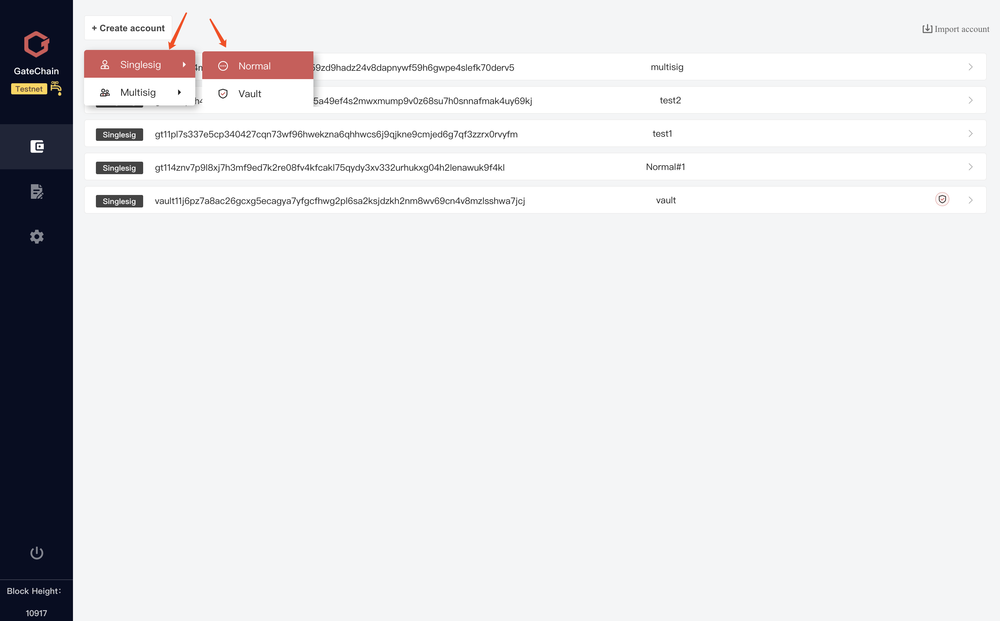

- 2 ）Enter an account name,  click “Create ”.

- 3 ）Enter the unlock password, click “Confirm”.

- 4 ）Account is created successfully. Pay attention to the identifier of single sigature account. Standard Account starts with “gt”.

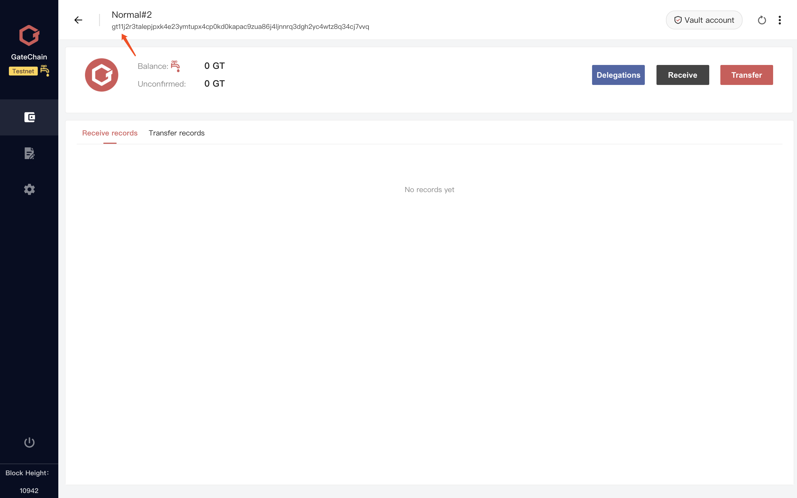

### 4.3 Account import

Besides creating an account, you can also use “Import account” function to import one you have created.  Steps as follows:
- 1 ) At main interface, click “Import account” and select" Single signature".   

- 2 ）Go to account importing interface, enter the following information one by one: account name (not necessarily its original account name), account backup file (keystore file) and decryption pass to the Keystore file (pass entered when exporting account file). Click “Import” button.
   
- 3 ）Enter the current unlock password and click “Confirm” button to finish account importing.

### 4.4 Give me GT
- **Get testnet GT from wallet：** 
	- At wallet overview interface, you can see a “Give me GT” icon. Click it and a testnet GT application is sent. Testnet GT will display at your wallet balance a few minutes later.   

- **Get testnet GT from website：** 
	- Access to website:  https://explorer.gatechain.io/faucet
	- Enter the account address to receive testnet GT and click Add application. Testnet GT will display at your wallet balance a few minutes later.   

> Each account can apply once per 24 hours. Each time applying for testnet GT from wallet will have the following prompt.
>  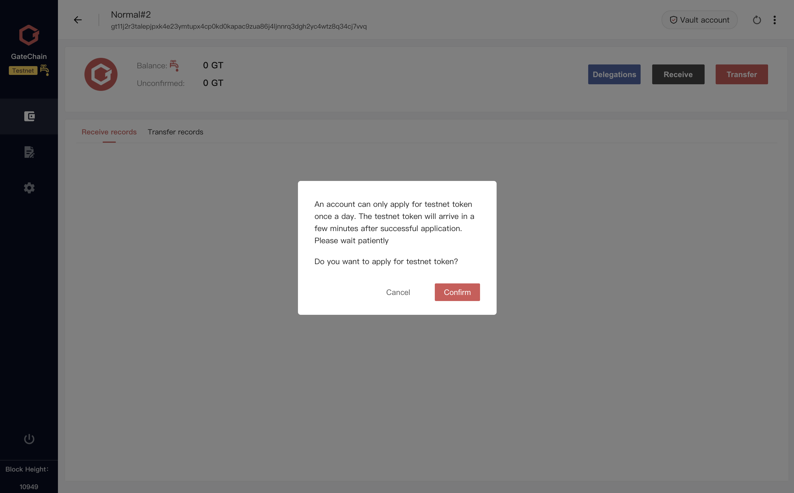 

### 4.5 Create Vault Account
- 1 ）At main interface, click  “Create account”, then select“Single signature ”-->>“Vault account.

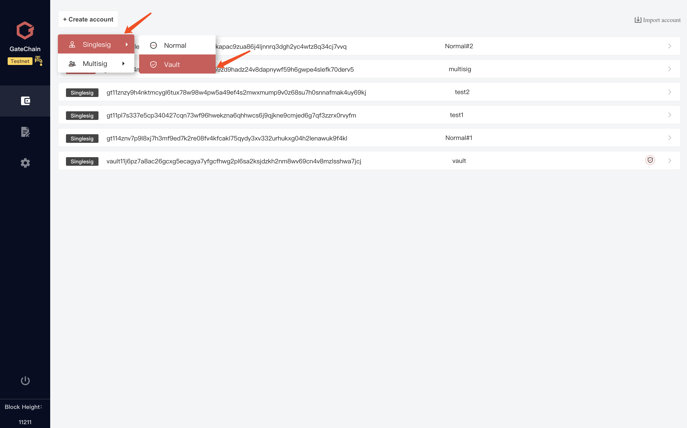

- 2 ）Enter an account name, and click “Create”
 
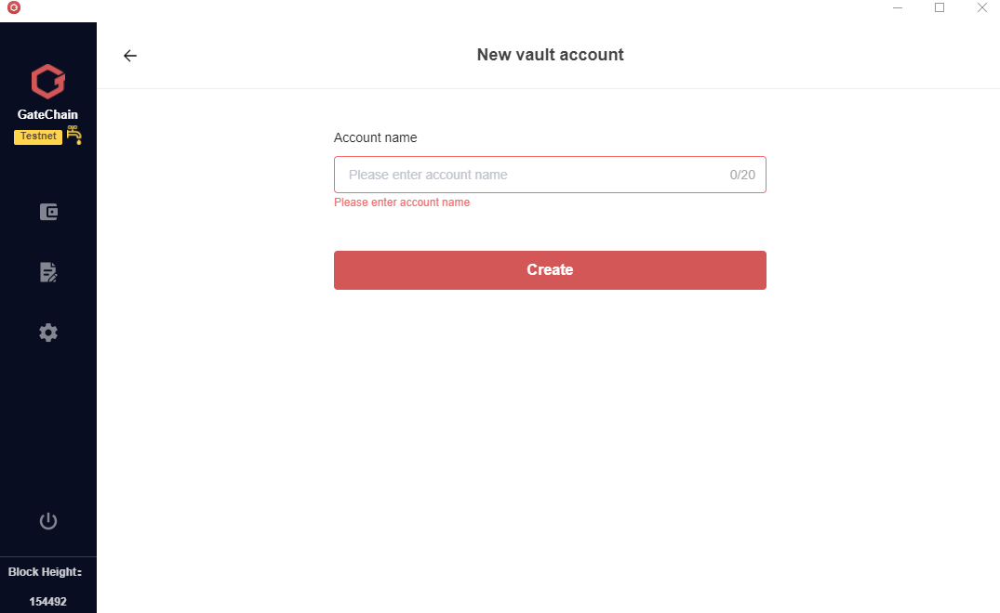

- 3 ）Enter unlock pass, click “confirm”.

- 4 ）Account is created successfully.  A prompt for activation will display. Click “Activate” button.

- 5 ）Select a fee payment account, enter a backup account as “Retrieval Account”. Select a revocable delay period (e.g.48 hrs ), clearing height ( e.g.5 years).Click “Next”.
  

- 6 ）After confirming Vault Account parameters for activation,click “Confirm”. Enter unlock password to activate the Vault Account.
 
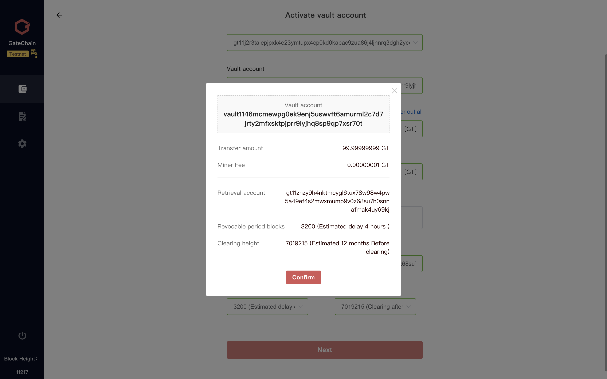  

> You can also activate Vault Account through a Standard Account.
> 
> - Access to the overview interface of another account you will use it to activate the Vault Account. Click "Activate other account" at the right side
>   
> - Access to activate Vault Account page.
> - Activation process is as above mentioned.  
> Note: the Standard Account used to activate the Vault Account will auto- fill “Retrieval Account” field. If you want to use another account as Retrieval Account, please modify it. 

### 4.6 The clearing time of Vault Account can be changed
Steps as follows:

- 1 ） Access to the Vault Account you want to change.  Click the change button right to  “Clearing height”.  
- 2 ）Access to change page and set the new clearing block height.   
- 3 ）Double check the information and enter the unlock password.  
- 4 ）Change transaction is successfully initiated.   

### 4.7 Setup Vault Account Activities Monitor

GateChain provides  two notification channels, via email and via short message.

- 1 ）Access to block explorer monitor page.
	- Click the icon right to  Vault Account address to access to account monitor settings page.  
	- Or visit [testnet explorer](https://explorer.gatechain.io/monitor) and Click"Monitor"	to access to account monitor Settings page. -  
- 2 ) Fill the account address to monitor and the mobile phones and emails to receive alert notification. 
  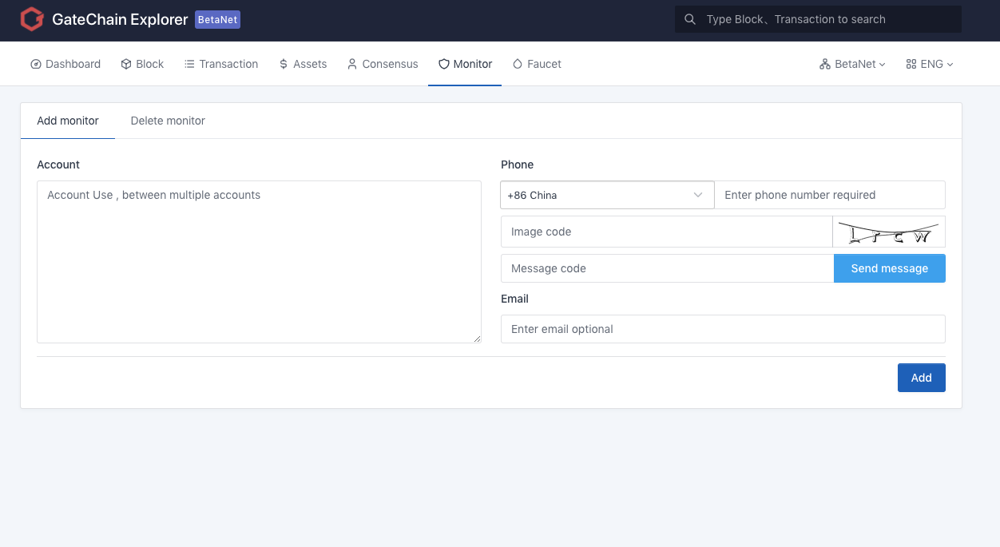 
  
### 4.8 Standard Account Irrevocable Payment
- 1 ）From the wallet list, select the account to make the payment transfer and Click to access to account overview.  

- 2 ) Select “Transfer” button.  

- 3 ) Access to transfer page, fill the recipient  address  and the payment amount. Check information and click “Send” button.
  

- 4 ) Double check the transfer information. Click “confirm” button.
  

- 5 ) Enter the unlock password and click "Confirm".
- 6 ) Receive a success message that the transaction is sent successfully.
 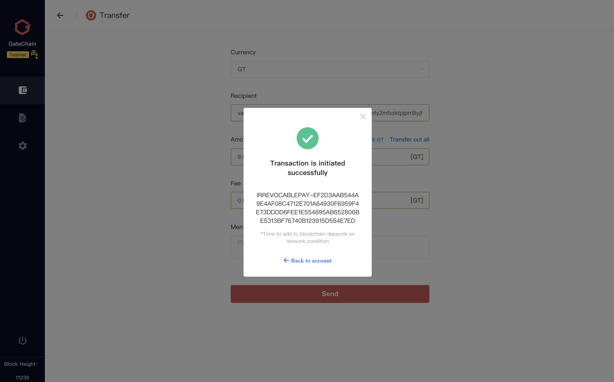 

Note 
>1.Standard Account starts with gt. Transaction is  irrevocable from address with prefix “gt” and you can receive it safely.

>2.Transaction from Standard Account starts with IRREVOCABLEPAY --.Transaction with such prefix is irrevocable.

- 7 ) View “Transfer Records” at account overview for this transaction record.

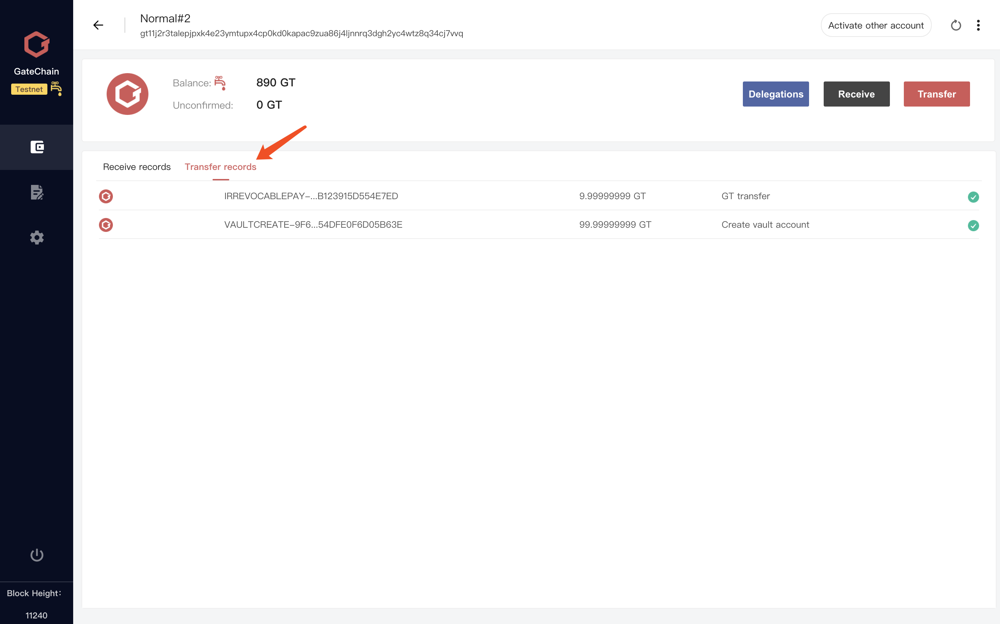

### 4.9 Vault Account Revocable Payment

Transfer from Vault Account will take effect with a delay. Compared with Standard Account, additional information is needed when make a transfer from Vault Account. Steps as follows:

- 1 ）Send Revocable Payment from a Vault Account 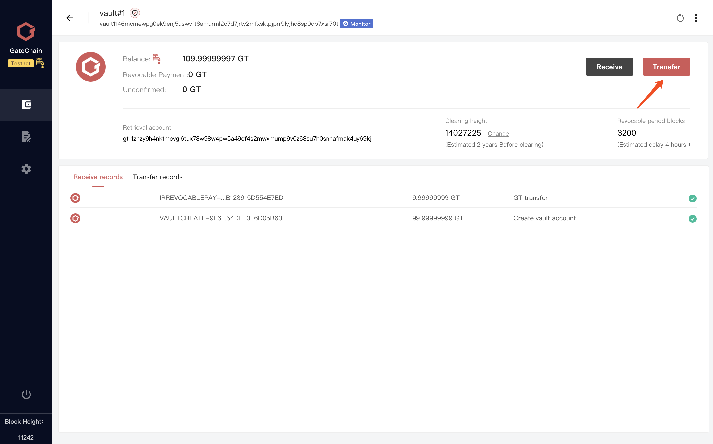 

- 2 ）Fill Recipient address, amount and other information, and click “Send” button
 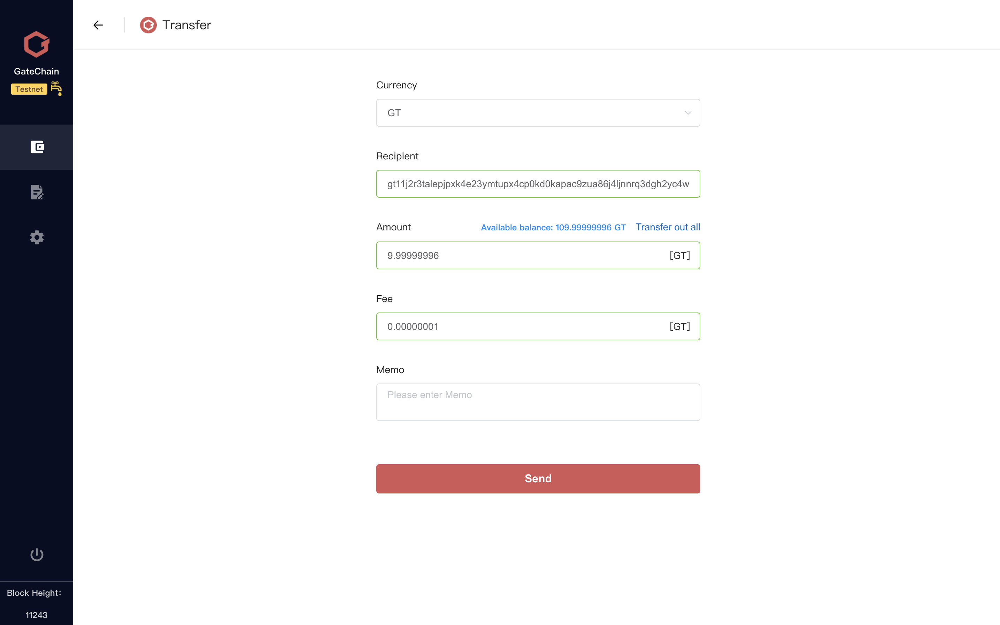 

- 3 ）Check the transfer information and click “Confirm” button.
  

- 4 ）Enter wallet login password  and you will receive a “revocable transaction is initiated  successfully’ notice.
  
	
> The recipient account can see this transaction in its Receive records. Click the transaction body to view the transaction details (transaction status, estimated confirmation time, amount, etc)
>  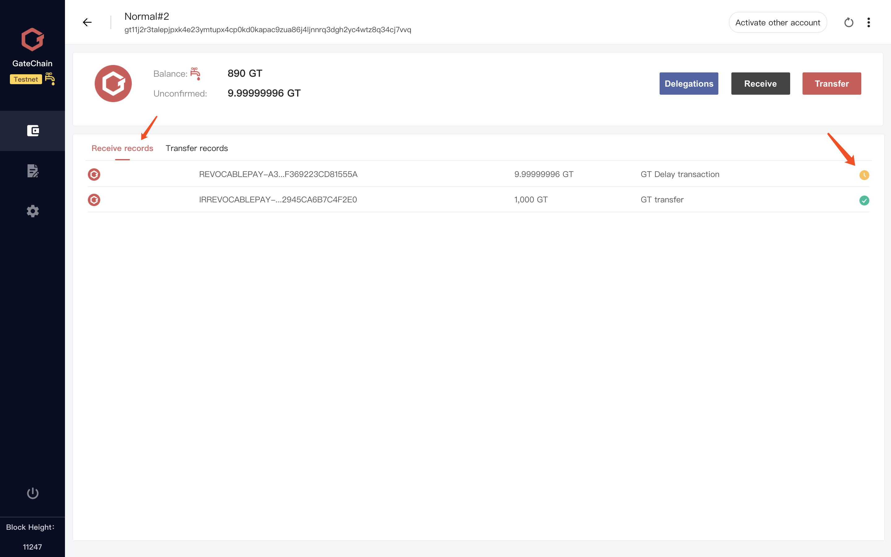 

- 5 ）If receive alarm has already set at Account Settings, a Receive alarm of vault account out going payment will be immediately  received following the transfer. 

- 6 ）Revoke the undesired vault account payment.At the account overview page, click transfer records to view revocable transaction record. Click “Revoke transaction”button at right side. 
 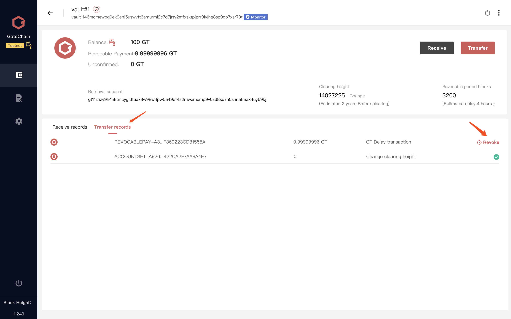 
- 7 ）Confirm the pending irrevocable transaction  information and  click “Next’
  
- 8 ）Double check the transaction details and enter the wallet login password. 
 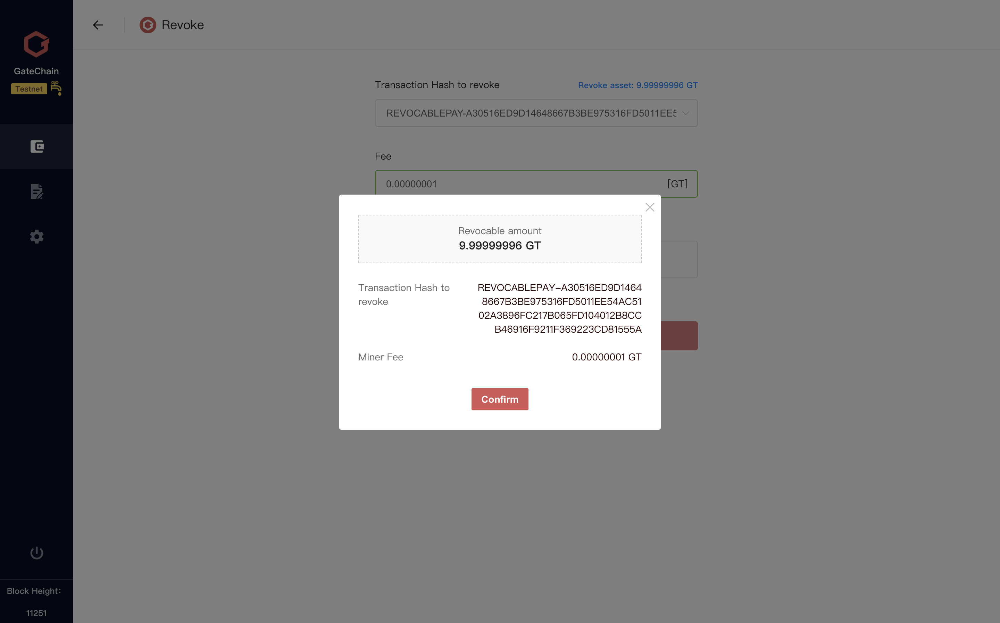 
- 9 ）Revoke transaction is initiated successfully.
 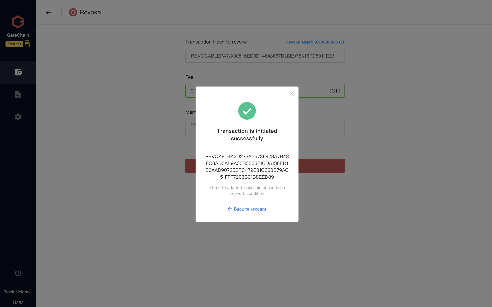 
- 10 ）This transaction will be moved to its bound Retrieval Account account. 
  

>Note 1. Note 1. Vault Account  starts with “vault”. Transaction initiated from address with prefix “vault” can be revoked within a  certain period of time. Attention: transaction can only be deemed as success when it is not revoked after the revocable delay period. 
>
>Note 2. Transaction ID from Vault Account  starts with REVOCABLEPAY --. When receiving  transaction with this prefix, attention  will be paid that the transaction can only be deemed as success when it is not revoked after revocable delay period.

---
## 5. Advanced Features
>This part involves  operations on account. Please use it with caution. misoperations may lead to asset loss. 

The wallet supports  account export, account delete, view private keys  and other operations for accounts in the local wallet account list. 

- Select the account to operate and  click to access to account overview.  

- Click upper right corner to access to account details.   

- View account details.  

> Standard Account only show “Account info’. While Vault Account will show"Vault Settings” in addition to “Account info”.

### 5.1 Account Export
- single signature account export
	- you can export single signature account  to a file for backup. Access to account details. 
	- Click  “Download” button right to“Keystore”.Enter unlock pass to back up the account. 
 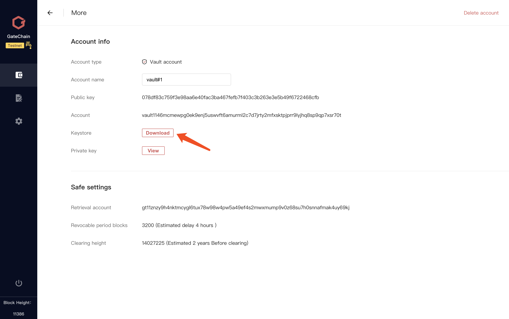 

### 5.2 View Private Key
- Access to account details. Then click “View” button right to“Private key”. Enter the unlock password to view the private key. 
  

>Do not screenshot or copy the private key and  save it in  computers that has connection   to  Internet to avoid risk.

### 5.3 Delete Account
- Access to Account details and click “Delete Account ”button at the upper right. 
 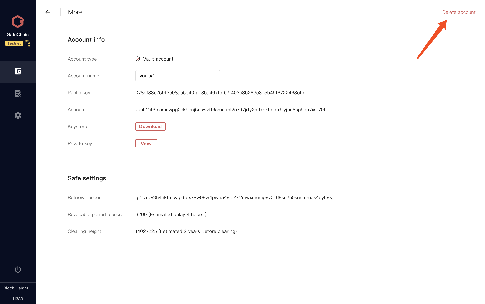 

- Enter the unlock pass and click “Confirm”button. The account is deleted.
  

### 5.4 Multiple Signatures Account
#### 5.4.1 Create a Multisig Account
* 1 ）At the main interface, click “Account”. Select   “multi-signature ”--->>“Standard Account”.  

* 2 ）Enter “Account name” and  select “total members”(2-7), “required signatures” and “member’s public key”(can use public key created in the wallet or enter a public key not locally created). Click "Next".  
* 3 ）Access to confirmation page and click “Create” button to finish.  
* 4 ) Publish the multisig account to the blockchain according to prompt.  
* 5 ）Publishing public key will incur a fee. Choose a payment account and click “Next".  
* 6 ）Confirm the information and enter the unlock pass.A transaction initiated successfully message will be returned. 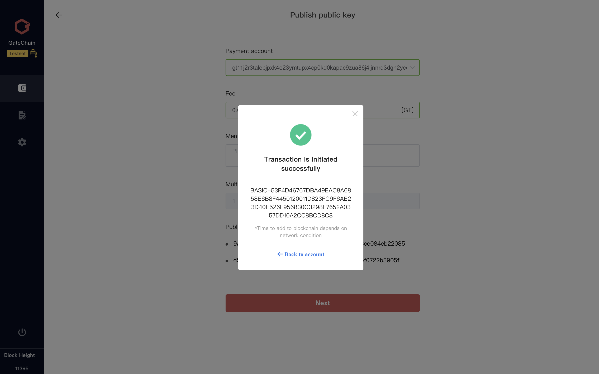 

> For Multisig  Vault Account, its account creation  process is the same with a Standard Multisig Account, and its activation process is the same with a normal  Vault Account.

#### 5.4.2 Export Multisig Account
* 1 ）From account list , select the multisig account to export and access to account details.  	
* 2 ) Select “Export multisig account” button. Enter the unlock pass to generate a multisig account file.  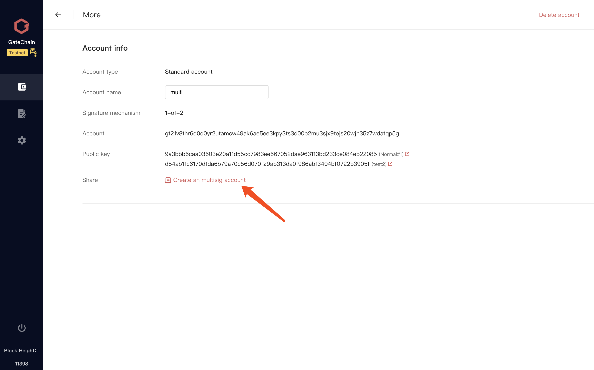 

#### 5.4.3 Multisig Transaction

* Initiating a multisig transaction is similar with a normal transaction. Enter the recipient account, amount and others. Click “Send”.   
* After confirming the transaction information, go to “Signature & Broadcast process” page.  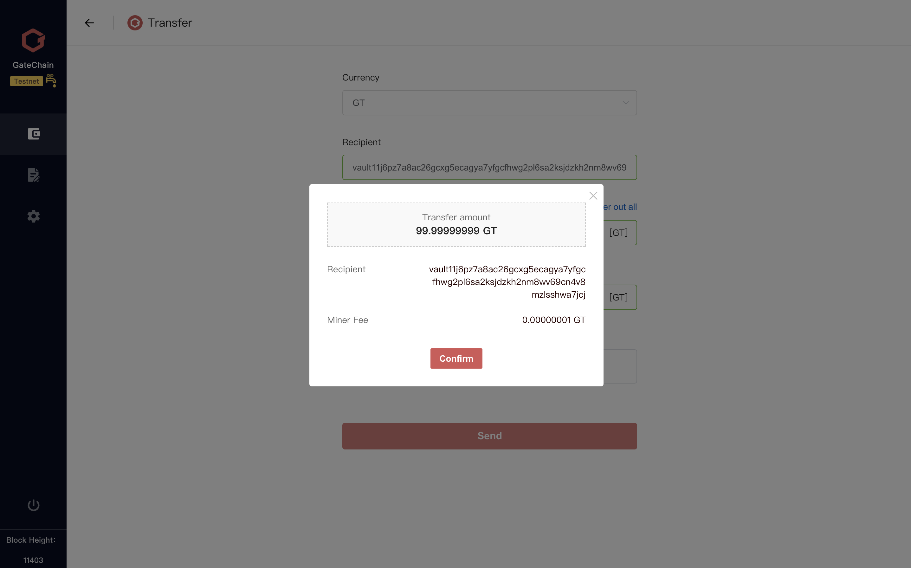 
* As multisig account varies in participating members, please finish “Collecting signatures” and “broadcast transaction” operations according to prompt in “Signature & Broadcast process” page.

**Example**
>   

---
### 6. Blockchain Explorer
-  To View account, transaction id, block, validator and more, visit block explorer for testnet at [https://explorer.gatechain.io/](https://explorer.gatechain.io/)。

### 7. Developer Document
- View developer document here:[https://www.gatechain.io/docs](https://www.gatechain.io/docs) 

